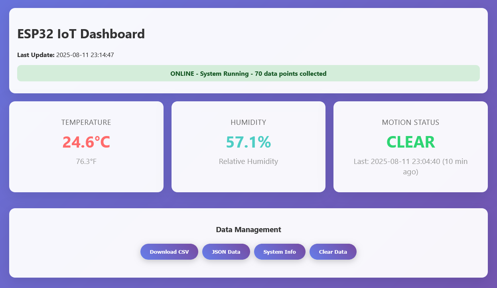

# ESP32 Local Data Logger

Logs temperature, humidity and motion locally on an ESP32 and serves the data (CSV + JSON + dashboard) over HTTP for easy import into Power BI Desktop or other analysis tools.

## ✨ Overview
This sketch runs on an ESP32, reads a DHT22 sensor (temperature / humidity) and a HC‑SR501 PIR motion sensor, and logs data every 10 seconds into a CSV file stored in SPIFFS (`/sensor_data.csv`). A lightweight web server exposes:
- A responsive dashboard (auto‑refresh) with current metrics
- Raw CSV download
- JSON API
- File/storage info
- Data reset (clear file)

Designed for simple, offline‑friendly local logging without external cloud dependencies (WiFi only used for NTP time sync + local access).




## ✅ Features
- DHT22 temperature (°C & °F) and humidity readings with retry logic
- Motion detection (interval aggregation: any motion within interval → `true`)
- 10‑second logging interval (configurable)
- SPIFFS CSV storage with automatic header creation
- Web dashboard (auto refresh, gradient UI, status indicators)
- Endpoints: CSV download, JSON data, system info, clear data
- Unix timestamp + human readable timestamps
- Data point counter
- Last motion timestamp + relative "ago" text

## 🧪 Logged Data Format (`sensor_data.csv`)
Header:
```
Timestamp,DateTime,Temperature_C,Temperature_F,Humidity_Percent,Motion_Detected,Data_Point
```
Example row:
```
1723372800,2025-08-11 12:00:00,23.50,74.30,41.20,false,42
```
Field meanings:
- `Timestamp` Unix epoch (seconds)
- `DateTime` Local time (configured via NTP + offsets)
- `Temperature_C` Celsius (float, 2 decimals)
- `Temperature_F` Fahrenheit (derived)
- `Humidity_Percent` Relative humidity
- `Motion_Detected` `true` if motion occurred at least once in the 10‑s interval
- `Data_Point` Sequential counter (starts at 1)

## 🌐 HTTP Endpoints
| Path | Method | Description |
|------|--------|-------------|
| `/` | GET | Live dashboard (auto refresh every 10 s) |
| `/download` | GET | Raw CSV file stream |
| `/data` | GET | JSON array of logged rows `{data:[...]}` |
| `/info` | GET | File size, storage usage, counts |
| `/clear` | GET | Deletes CSV and recreates header (resets counter) |

## 🛠 Hardware
| Component | Notes |
|-----------|-------|
| ESP32 Dev Module | Any standard ESP32 (with SPIFFS support) |
| DHT22 sensor | Data pin connected to GPIO 21 (default) |
| HC‑SR501 PIR | Output connected to GPIO 13 (default) |
| (Optional) USB Power | Stable 5V supply, ensure sensor warm‑up |

### Wiring (default pins)
- DHT22: VCC → 3V3, GND → GND, DATA → GPIO 21 (+ 10k pull‑up to 3V3 if module doesn’t include one)
- HC-SR501: VCC → 5V (or 3V3 if module supports), GND → GND, OUT → GPIO 13

You can change pins by editing:
```cpp
#define DHT22_PIN 21
#define MOTION_PIN 13
```

## 💻 Software Setup
1. Install Arduino IDE (or use PlatformIO).
2. Install ESP32 board support (Boards Manager → `esp32`). Select a board like "ESP32 Dev Module".
3. Required libraries (Library Manager):
   - `DHT sensor library` by Adafruit
   - `Adafruit Unified Sensor` (dependency)
   - `ArduinoJson` (currently included; JSON in this sketch is manually built, so library could be removed if unused elsewhere)
4. Open `ESP32_Local_DataLogger.ino`.
5. (Recommended) Replace WiFi credentials with your own before flashing:
```cpp
const char* ssid = "YOUR_WIFI";
const char* password = "YOUR_PASS";
```
6. Select correct COM port and upload.
7. Open Serial Monitor @ 9600 baud to view status.

## ⏱ Time / Timezone
Modify these if you need another timezone:
```cpp
const char* ntpServer = "pool.ntp.org";
const long gmtOffset_sec = 3 * 3600;  // UTC+3 example
const int daylightOffset_sec = 0;
```

## 🔄 Logging Interval
Change how often data is recorded:
```cpp
const unsigned long LOG_INTERVAL = 10000; // ms
```
Reducing interval increases write frequency & flash wear; keep ≥5s unless needed.

## 📊 Importing into Power BI Desktop
Option A – Manual file:
1. Visit `http://<device-ip>/download`
2. Save `sensor_data.csv`
3. In Power BI: Get Data → Text/CSV → select file → Load

Option B – Direct Web import
1. Get IP from Serial Monitor (e.g., `192.168.1.50`)
2. Power BI: Get Data → Web → URL: `http://192.168.1.50/download`
3. Confirm delimiter detection → Load
4. (Optional) Refresh all tables to access the latest data: Home → Refresh

## 🗄 Storage Considerations
- SPIFFS size depends on partition scheme (Tools → Partition Scheme)
- Each row ~60–90 bytes (depends on numbers). Approx rows per MB: ~12k–16k.
- Check usage at `/info`.
- Clear data periodically (`/clear`) or implement rotation if extending.
